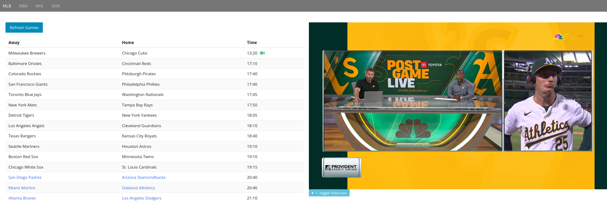

# LazyDan2

[Go team, go sports](https://www.youtube.com/watch?v=q13uNlRXZrk)

**LazyDan2** provides a simple API for scraping and proxying sports streams.

Features are built around this core, highlights being

* Simple website with schedules and video player
* DVR feature to schedule game downloads
* SQLite DB to store game and DVR information



## Tech Stack

### Client-side

* React + Typescript
* [Bulma CSS](https://bulma.io/)
* [Clappr](https://github.com/clappr/clappr) video player

### Server-side

* .NET 8
* [Coravel](https://docs.coravel.net/) is used to handle recurring jobs and the DVR queueing
* [CliWrap](https://github.com/Tyrrrz/CliWrap) is used to shell out to `streamlink`
* [SixLabors.ImageSharp](https://github.com/SixLabors/ImageSharp) is used to create game posters with the teams' logos
* [streamlink](https://streamlink.github.io/) for downloading games
* [SQLite](https://www.sqlite.org/index.html) for persisting the game schedule and DVR information
* [Threadfin](https://github.com/Threadfin/Threadfin) as a Live TV (M3U / XMLTV) shim

## Dependencies

* Docker

## Configuration

[appsettings.json](./src/appsettings.json) contains sample values that should be [overridden](https://learn.microsoft.com/en-us/dotnet/core/extensions/configuration) by `appsettings.Production.json` or runtime ENV VARs

### Required

* `LazyDanUrl` = domain where website is being hosted
* `DownloadPath` = directory used by DVR for game downloads
* `CfbDataToken` = Bearer token for `api.collegefootballdata.com` calls when updating CFB schedule
* `ConnectionStrings__Sqlite` = SQLite connection string.  The DB is created if not found at the specified path

### Optional

* `LazyDanLanUrl` = (optional) override for `LazyDanUrl` in DVR recording code
* `PlexUrl`, `PlexAccessToken` = hit Plex webhook after file download
* `JellyfinUrl`, `JellyfinAccessToken` = hit Jellyfin webhook after file download
* `PushbulletAccessToken` = send push when game recording started and if it ends too early

## Docker Notes

1. The .NET app listens to port 8080 inside the container, to serve the website and APIs.  Add a port mapping to a host port if you care about this, otherwise skip.
2. Set `DownloadPath` and `ConnectionStrings__Sqlite` (data source path) to container paths, and use volumes to mount the target directories.  For instance, I use `/data/tv` and `/data/lazydan2` as the container paths, with `/mnt/user/tv` and `/mnt/user/documents/lazydan2` as the host paths

```yaml
    # example Ansible deploy task
    - name: Run Docker container
      docker_container:
        name: LazyDan2
        image: lazydan2
        state: started
        restart_policy: unless-stopped
        published_ports: "8081:8080"
        user: "99:100"
        env:
          TZ: "America/Chicago"
          DownloadPath: "/data/tv"
        volumes:
          - "/mnt/user/documents/lazydan2:/data/lazydan2"
          - "/mnt/user/tv:/data/tv"
```

## Logs

Written to STDOUT, i.e. [the right way](https://12factor.net/logs)